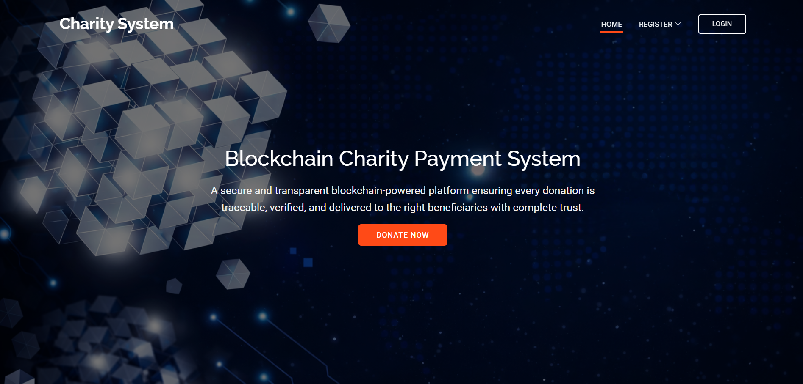
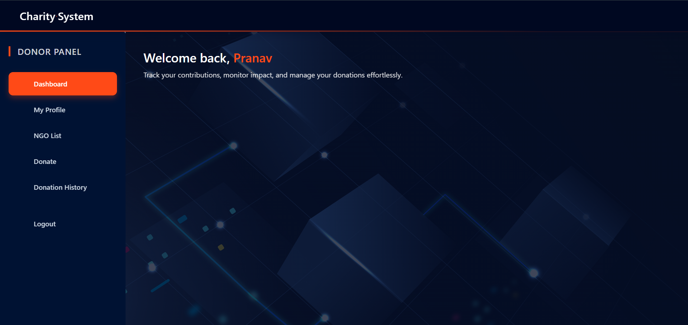
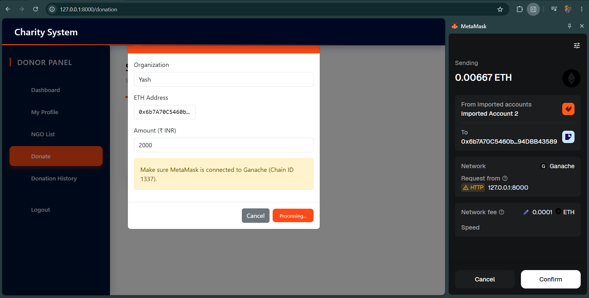
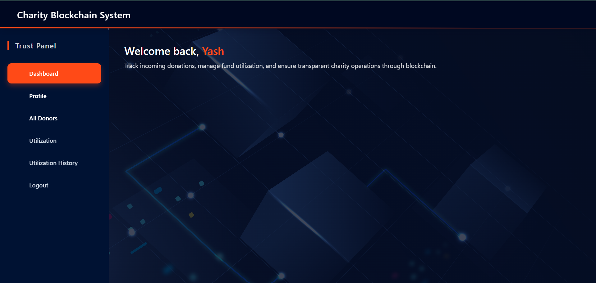
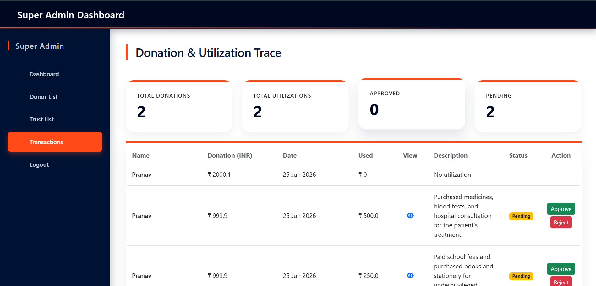
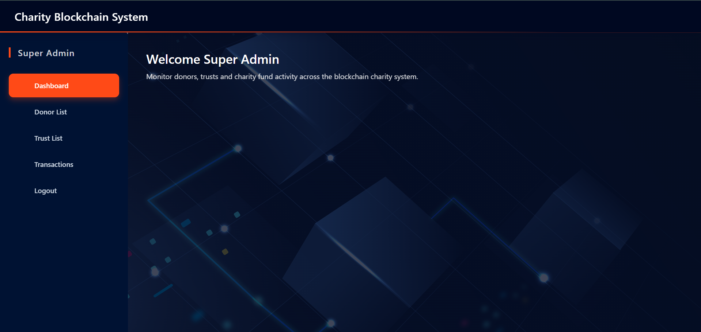

# 🤝 Charity System — Blockchain-Powered Donation & Transparency Platform

<p align="center">
  
  
  
  
  
</p>

<p align="center">
  <b>A full-stack blockchain charity platform where donors send ETH via MetaMask, trusts utilize funds with proof, and every transaction is verified on-chain for complete transparency.</b>
</p>

---

## 🖼️ Screenshots

### 🏠 Home Page


### 👤 Donor Dashboard


### 💸 Donation Page (MetaMask)


### 🏛️ Trust Dashboard


### 📊 Transaction Trace (Super Admin)


### 🛡️ Admin Dashboard


---

## 🚀 Features

- 🔐 **Multi-role Login** — Donor, Trust, and Super Admin
- 💰 **MetaMask Donations** — Donors send real ETH to Trust wallets via MetaMask
- 🔗 **On-chain Verification** — Every TX hash verified against Ganache blockchain
- 🧾 **Duplicate Prevention** — Same TX hash cannot be recorded twice
- 📋 **Utilization Tracking** — Trusts log how donated funds are spent with proof
- ✅ **Super Admin Approval** — Admin approves/rejects each utilization entry
- 📜 **Donation History** — Donors see full history with ETH + INR conversion
- 📈 **Trust Dashboard** — Live balance, total received, total utilized, donor list
- 🔍 **Transaction Trace** — Admin sees full donation → utilization chain per donor
- 🧮 **ETH → INR Conversion** — All amounts shown in both ETH and INR (₹3,00,000/ETH)
- 🔒 **Integrity Hash** — SHA-256 hash generated per transaction for tamper detection

---

## ⚙️ Tech Stack

| Layer | Technology |
|-------|-----------|
| Backend | Django 4.x (Python) |
| Frontend | Bootstrap 5, HTML, CSS, JS |
| Database | SQLite3 |
| Blockchain | Ethereum (Ganache local chain) |
| Web3 Library | web3.py (backend), ethers.js (frontend) |
| Wallet | MetaMask |
| Security | SHA-256 Integrity Hash per transaction |

---

## 🔗 Blockchain Flow

```
DONATION FLOW:
Donor selects a Trust
    → MetaMask popup opens
    → Donor sends ETH to Trust wallet address
    → TX hash sent to Django backend
    → Backend connects to Ganache via web3.py
    → TX verified (sender, receiver, amount)
    → SHA-256 integrity hash generated
    → Donation saved to DB with TX hash

UTILIZATION FLOW:
Trust logs a fund utilization
    → Trust selects donation, enters amount (INR), purpose, category
    → Uploads proof (image or bill)
    → Saved as Utilization (pending)
    → Super Admin reviews and approves/rejects
    → Approved utilizations visible to donors in donation history
```

---

## 👥 Roles & Access

| Role | Registration | Access |
|------|-------------|--------|
| Donor | Register via form | Donate via MetaMask, view donation history |
| Trust | Register via form + ETH address | View donors, log utilization, view balance |
| Super Admin | `Superadmin@gmail.com` / `Superadmin@123` | Approve utilizations, view all donors & trusts, transaction trace |

---

## 🛠️ Local Setup

### 1. Clone the repo
```bash
git clone https://github.com/ujjwalkatare/charity-system.git
cd charity-system
```

### 2. Create virtual environment
```bash
python -m venv venv
venv\Scripts\activate        # Windows
source venv/bin/activate     # Mac/Linux
```

### 3. Install dependencies
```bash
pip install -r requirements.txt
```

### 4. Run migrations
```bash
python manage.py makemigrations
python manage.py migrate
```

### 5. Start Ganache
- Download [Ganache](https://trufflesuite.com/ganache/)
- Start a new workspace on port **7545**
- Note down account addresses and private keys

### 6. Configure MetaMask
- Add custom network: `http://127.0.0.1:7545` — Chain ID: `1337`
- Import a Ganache account using its private key

### 7. Run the server
```bash
python manage.py runserver
```

### 8. Open in browser
```
http://127.0.0.1:8000
```

---

## 📁 Project Structure

```
charity_system/
├── app/
│   ├── models.py          # trust_profile, Donation, Utilization models
│   ├── views.py           # All views + web3.py blockchain verification
│   ├── urls.py            # URL routing
│   ├── auth.py            # Custom authentication helpers
│   └── admin.py           # Django admin registration
├── templates/
│   ├── index.html                    # Home page
│   ├── log_in.html                   # Unified login
│   ├── donor_register.html           # Donor registration
│   ├── trust_register.html           # Trust registration with ETH address
│   ├── user_dashboard.html           # Donor dashboard
│   ├── donation.html                 # MetaMask donation page
│   ├── show_donation.html            # Donor donation history
│   ├── trust_dashboard.html          # Trust dashboard with balance
│   ├── utilize_donation.html         # Trust utilization form
│   ├── show_utilization.html         # Trust utilization history
│   ├── super_admin_dashboard.html    # Admin overview
│   └── super_admin_transactions.html # Full donation & utilization trace
├── screenshots/           # UI screenshots
├── static/                # CSS, JS, images
├── manage.py
└── requirements.txt
```

---

## 📦 Requirements

```
django
web3
```

Install all:
```bash
pip install -r requirements.txt
```

---

## 🔐 Environment Notes

- Ganache must be running on `http://127.0.0.1:7545` before making donations
- Trust must register with a **valid Ganache wallet address** to receive ETH
- Donor's MetaMask must be connected to Ganache network (Chain ID: 1337)
- MetaMask active account must have sufficient ETH balance in Ganache
- `db.sqlite3` and `media/` are excluded from git — run migrations fresh after cloning
- Super Admin login uses hardcoded session-based auth (not a Django user account)

---

## 👨‍💻 Author

**Ujjwal Katare**

---

## ⭐ Give a Star

If you found this project helpful, please consider giving it a ⭐ on GitHub!
